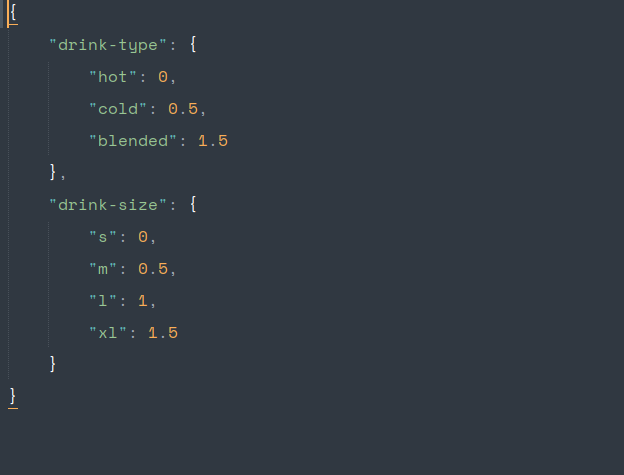

Pricing module
===

> Purpose: pricing a cart

## Structures

- **This modular is an stack of 3 levels**:
	
	1. [Item level](./design/item.md)
		- Responsible for modeling and validation Item data

	2. Cart Line level
		- Responsible for pricing a line of cart: An Item + quantity + discount-at-line-level

	3. Cart level
		- Responsible for pricing a cart: all cart lines + discount-at-order-level + tax

## Interface

> There are 2 interfaces, called: low-interface and high-interface

1. Low-interface
	
	- where to plug dataset in

	- dataset must provide 2 groups

		1. Item data: a list of Item objects:	

			

		2. Attributes metrics: 

			> a list of attributes, each attribute contains a map between its values and corresponding additional-price 

			

2. High-interface
	
	1. Item-level-interface

		- Purpose: to provide a way to create an ItemVariant

		- Use-case:

			- A cashier want to select an coffee and input information for it. This interface can help developer make it done.

		*Not done yet*
	
	2. Cart-line-level-interface

		- Purpose: to calculate price of an cart line + discount-cart-line-level

		- Use-case:

			- Suppose cart line level contain 5 cups of chocolate-coffee and with discount of 20% for buying more than 4 cups of same kind.

		*Not done yet*

	3. Cart-interface

		- Purpose: to calcualte price of a cart + discount-cart-level + tax

		- Use case

			- A customer select all items and put them in the cart, now he/she want to see the price with tax or not, this interface help developer make it done.

			- A customer having a discount for an order with price greater than $10, and he ordered a cart of $12. 

		- APIs

			- need to provide buyer's ID

		*Not done yet*

## Glossary

0. Item: in general mean one particular product of the shop, such as coffee cup, milk-tea or a sandwich.

1. Cart line:
	- When ordering an item, it will attach with its quantity, which forms a cart line

2. A cart 
	- contain list of items
	- attach to an customer's id

3. Customer: customer of the shop, who buy the coffee-item

4. User: who use the application

## Currently work

- working on testing [Item-level](./design/item.md)